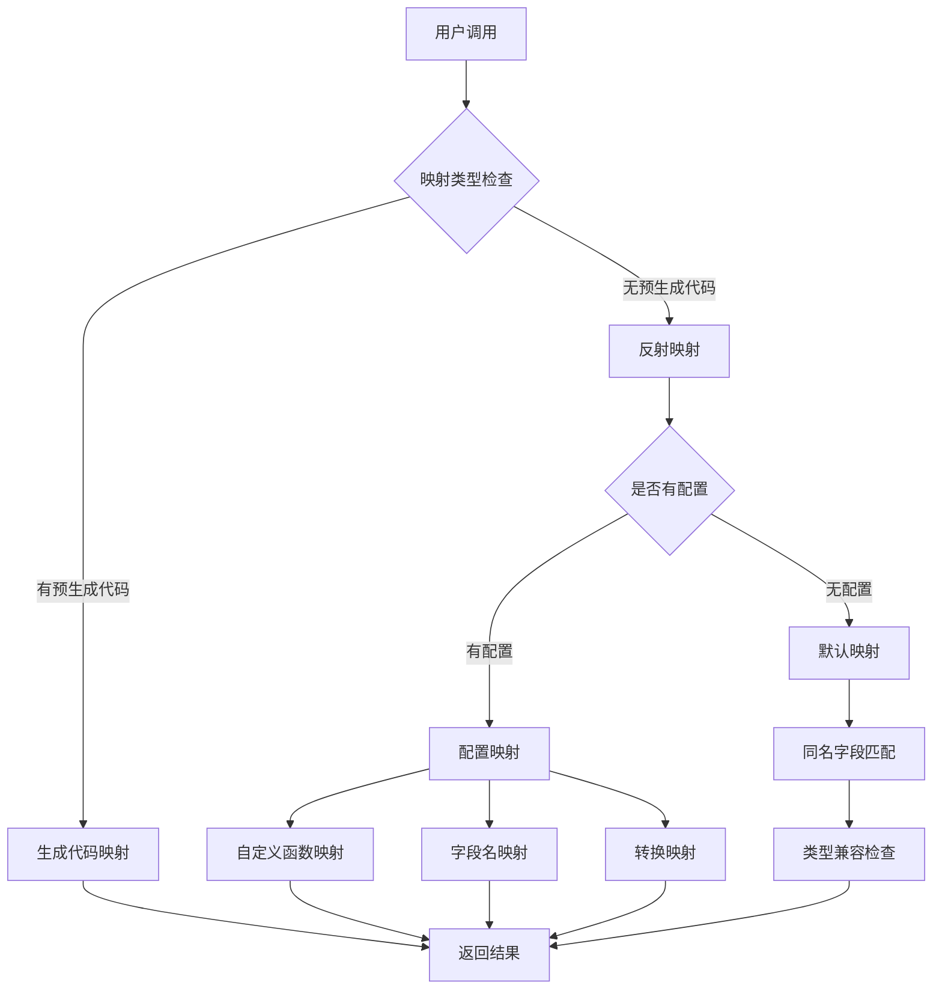
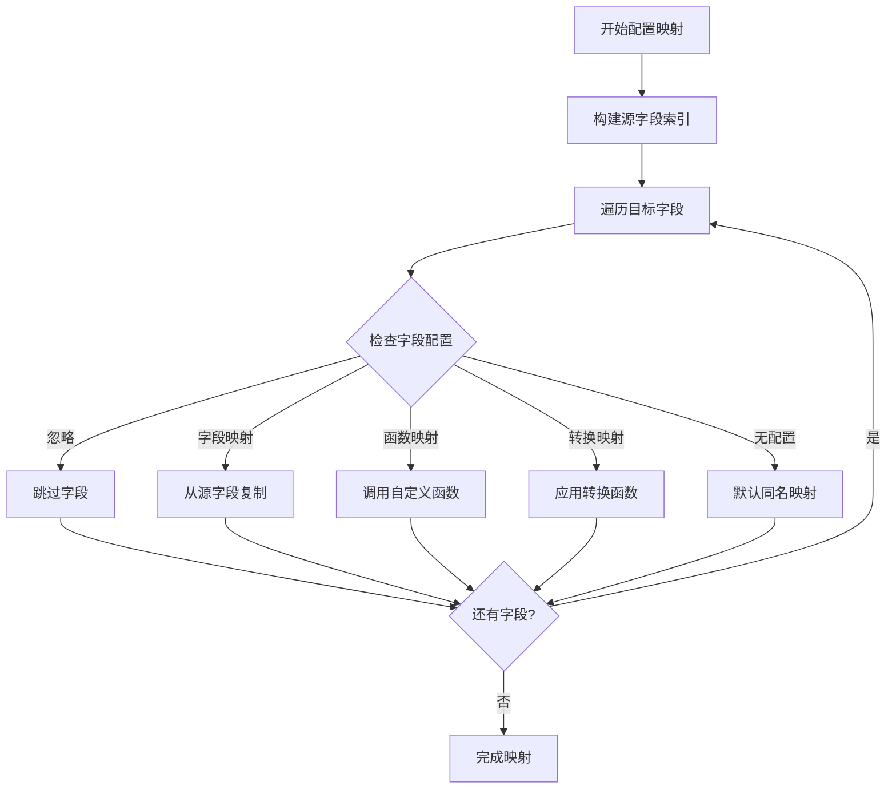
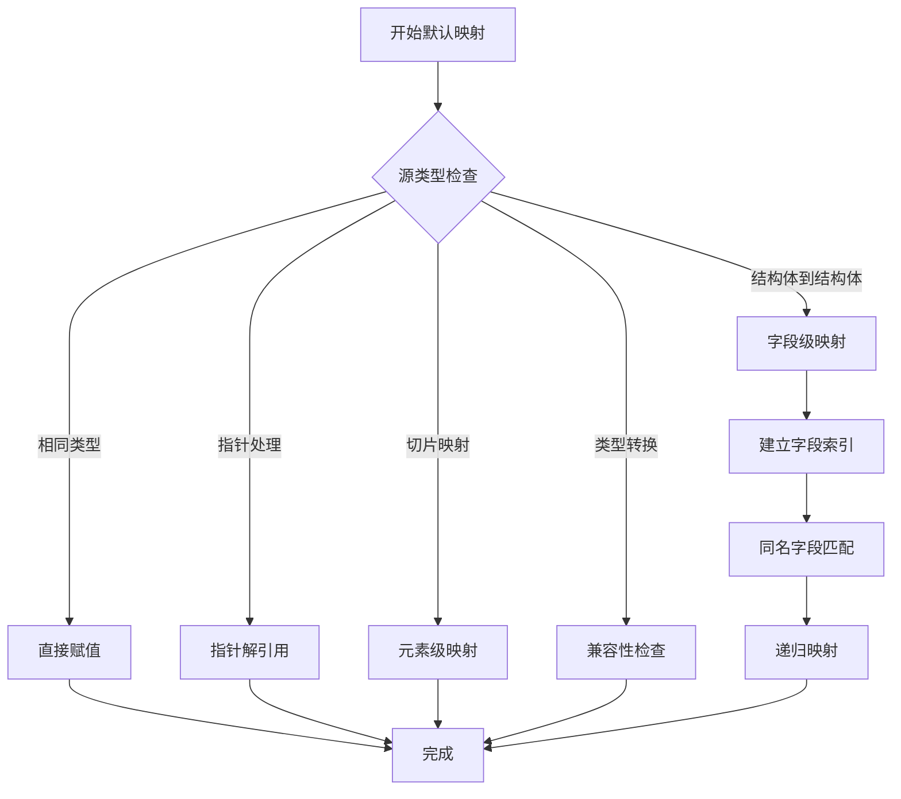
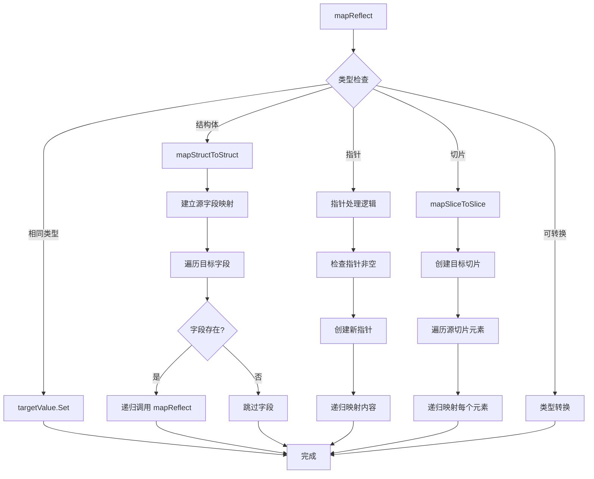
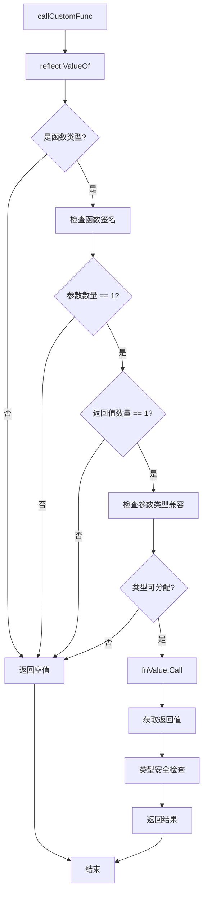
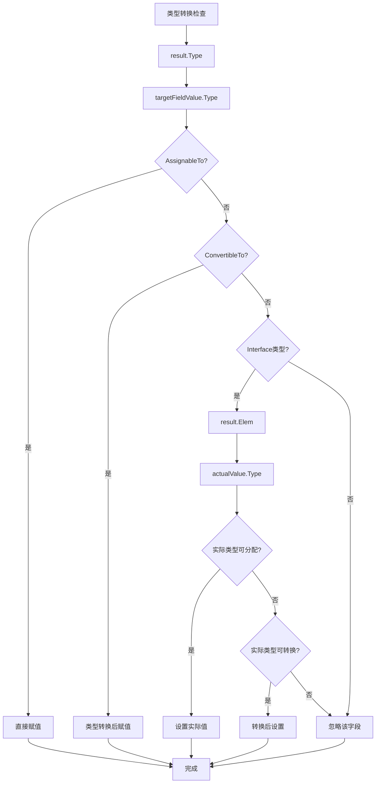
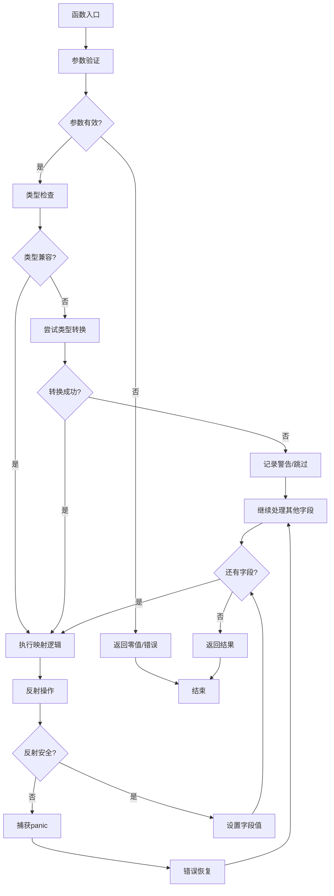
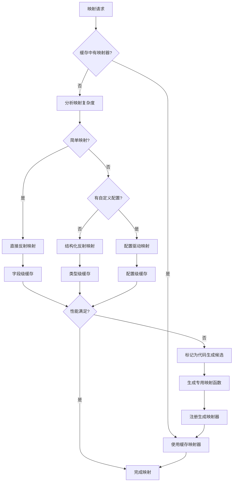
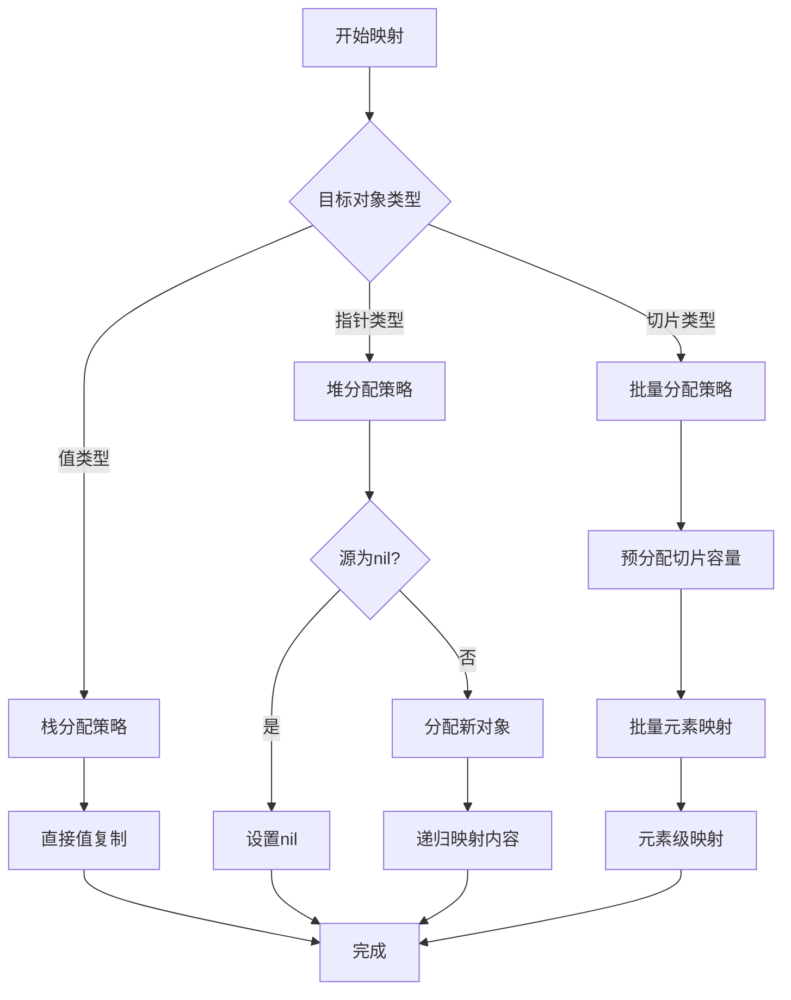

# Go Mapster 项目技术文档

## 项目概述

Go Mapster 是一个高性能的对象映射库，采用"约定优于配置"的设计理念，支持零配置自动映射和灵活的自定义配置。

## 核心架构设计

### 1. 系统架构图



### 2. 包结构设计

```
mapster/
├── mapster.go          # 核心 API 入口
├── config.go           # 配置系统
├── reflection.go       # 反射映射引擎
├── mapster_test.go     # 单元测试
├── benchmark_test.go   # 性能测试
└── examples/           # 示例代码
```

## 核心函数设计

### 1. 主要 API 函数

#### `Map[T any](src any) T`
**功能**: 将源对象映射到目标类型
**设计思路**:
- 使用泛型确保类型安全
- 优先使用生成的映射函数
- 回退到反射映射

```go
func Map[T any](src any) T {
    // 1. 空值检查
    if src == nil {
        var zero T
        return zero
    }

    // 2. 获取类型信息
    srcType := reflect.TypeOf(src)
    targetType := reflect.TypeOf(*new(T))

    // 3. 尝试使用生成的映射器
    if mapper := getGeneratedMapper(srcType, targetType); mapper != nil {
        if mapperFunc, ok := mapper.(func(interface{}) interface{}); ok {
            return mapperFunc(src).(T)
        }
    }

    // 4. 回退到反射映射
    return reflectionMap[T](src)
}
```

#### `MapSlice[T any](src any) []T`
**功能**: 批量映射切片
**优化**: 预分配切片容量，避免动态扩容

#### `MapTo[T any](src any, target *T)`
**功能**: 映射到现有对象
**用途**: 避免额外内存分配

### 2. 配置系统设计

#### 配置数据结构

```go
type MappingDefinition struct {
    SourceType    reflect.Type
    TargetType    reflect.Type
    FieldMappings map[string]FieldMapping
}

type FieldMapping struct {
    TargetField string
    MappingType MappingType
    SourceField string
    CustomFunc  interface{}
    Transform   interface{}
    Condition   interface{}
}
```

#### 配置流程图

```mermaid
graph LR
    ConfigStart[Config[S,T]()] --> MapMethod[Map(字段名)]
    MapMethod --> MappingTypeChoice{映射类型}
    MappingTypeChoice -->|FromField| FieldMapping[字段映射]
    MappingTypeChoice -->|FromFunc| FunctionMapping[函数映射]
    MappingTypeChoice -->|Transform| TransformMapping[转换映射]
    MappingTypeChoice -->|When| ConditionalMapping[条件映射]
    FieldMapping --> RegisterConfig[Register()]
    FunctionMapping --> RegisterConfig
    TransformMapping --> RegisterConfig
    ConditionalMapping --> RegisterConfig
    RegisterConfig --> StoreGlobalConfig[存储到全局配置]
```

### 3. 反射映射引擎

#### 核心函数设计

##### `reflectionMap[T any](src any) T`
**执行流程**:
1. 创建目标对象
2. 检查是否有自定义配置
3. 选择映射策略（配置映射 vs 默认映射）

##### `mapWithConfig(srcValue, targetValue, config)`
**配置映射流程**:



##### `mapReflect(srcValue, targetValue)`
**默认映射策略**:



## 性能优化策略

### 1. 反射优化

#### 字段缓存机制
```go
// 源字段索引缓存
srcFields := make(map[string]reflect.Value)
for i := 0; i < srcType.NumField(); i++ {
    field := srcType.Field(i)
    if field.IsExported() {
        srcFields[field.Name] = srcValue.Field(i)
    }
}
```

#### 类型兼容性检查
```go
// 智能类型转换
if result.Type().AssignableTo(targetFieldValue.Type()) {
    targetFieldValue.Set(result)
} else if result.Type().ConvertibleTo(targetFieldValue.Type()) {
    targetFieldValue.Set(result.Convert(targetFieldValue.Type()))
} else if result.Kind() == reflect.Interface && !result.IsNil() {
    // 处理 interface{} 返回值
    actualValue := result.Elem()
    if actualValue.Type().AssignableTo(targetFieldValue.Type()) {
        targetFieldValue.Set(actualValue)
    }
}
```

### 2. 内存优化

#### 预分配策略
- 切片映射时预分配目标切片
- 避免多次内存分配和复制

#### 零拷贝优化
- 相同类型直接赋值
- 避免不必要的数据复制

### 3. 代码生成优化（未来实现）


## 错误处理机制

### 1. 类型安全检查
- 编译时泛型类型检查
- 运行时类型兼容性验证

### 2. 空值处理
```go
// 多层空值检查
if src == nil {
    return zero
}
if !srcValue.IsValid() || !targetValue.IsValid() {
    return
}
```

### 3. 函数调用安全
```go
// 自定义函数调用保护
func callCustomFunc(fn interface{}, src interface{}) reflect.Value {
    fnValue := reflect.ValueOf(fn)
    if fnValue.Kind() != reflect.Func {
        return reflect.Value{}
    }
    
    fnType := fnValue.Type()
    if fnType.NumIn() != 1 || fnType.NumOut() != 1 {
        return reflect.Value{}
    }
    // ... 安全调用
}
```

## 测试策略

### 1. 单元测试覆盖
- 基础映射功能
- 配置映射功能
- 边界条件测试
- 错误处理测试

### 2. 性能基准测试
```go
// 基准测试指标
BenchmarkBasicMapping-8         927649   1199 ns/op   416 B/op   12 allocs/op
BenchmarkSliceMapping-8           9754 120473 ns/op 51115 B/op 1202 allocs/op
BenchmarkWithoutConfiguration-8 2441320   490 ns/op   224 B/op    8 allocs/op
```

### 3. 测试数据设计
- 简单结构体映射
- 复杂嵌套对象
- 大型切片处理
- 特殊类型处理

## 扩展性设计

### 1. 插件化架构
- 自定义映射函数接口
- 转换器插件系统
- 验证器集成点

### 2. 代码生成接口
```go
// 为代码生成器预留的接口
type GeneratedMapper interface {
    Map(src interface{}) interface{}
    SourceType() reflect.Type
    TargetType() reflect.Type
}
```

### 3. 配置扩展点
- 自定义映射策略
- 条件映射逻辑
- 类型转换器

## 未来优化方向

### 1. 编译时代码生成
- AST 分析工具
- 模板代码生成
- Go generate 集成

### 2. 高级映射功能
- 深度嵌套对象映射
- 循环引用处理
- 动态字段映射

### 3. 性能进一步优化
- 字段访问缓存
- 类型信息预计算
- 并发安全优化

## 内部关键函数调用逻辑

### 1. 主要映射函数调用链

```mermaid
graph TD
    MapFunctionEntry[Map[T any]src any] --> NullCheck{src == nil?}
    NullCheck -->|是| ReturnZeroValue[返回零值]
    NullCheck -->|否| GetTypeInfo[获取类型信息]
    
    GetTypeInfo --> CheckGeneratedMapper[getGeneratedMapper]
    CheckGeneratedMapper --> HasGeneratedMapper{有生成映射器?}
    HasGeneratedMapper -->|是| CallGeneratedMapper[调用生成映射器]
    HasGeneratedMapper -->|否| UseReflectionMap[reflectionMap[T]]
    
    UseReflectionMap --> CreateTargetObject[创建目标对象]
    CreateTargetObject --> GetMappingConfigCall[GetMappingConfig]
    GetMappingConfigCall --> HasCustomConfig{有自定义配置?}
    HasCustomConfig -->|是| UseMapWithConfig[mapWithConfig]
    HasCustomConfig -->|否| UseMapReflect[mapReflect]
    
    UseMapWithConfig --> BuildSourceFieldIndex[构建源字段索引]
    UseMapWithConfig --> IterateTargetField[遍历目标字段]
    UseMapWithConfig --> ApplyFieldMapping[应用字段映射]
    
    UseMapReflect --> CheckTypeCompatibility[检查类型兼容性]
    UseMapReflect --> CallMapStructToStruct[mapStructToStruct]
    
    CallGeneratedMapper --> ReturnFinalResult[返回结果]
    ApplyFieldMapping --> ReturnFinalResult
    CheckTypeCompatibility --> ReturnFinalResult
    CallMapStructToStruct --> ReturnFinalResult
    ReturnZeroValue --> ReturnFinalResult
```

### 2. 配置系统调用逻辑

```mermaid
graph TD
    ConfigCall[Config[S,T]] --> CreateConfigBuilder[创建 ConfigBuilder]
    CreateConfigBuilder --> MapMethodCall[Map方法调用]
    MapMethodCall --> CreateFieldConfigBuilder[创建 FieldConfigBuilder]
    
    CreateFieldConfigBuilder --> ConfigTypeChoice{配置类型}
    ConfigTypeChoice -->|FromField| SetFieldMapping[设置字段映射]
    ConfigTypeChoice -->|FromFunc| SetFunctionMapping[设置函数映射]
    ConfigTypeChoice -->|Transform| SetTransformMapping[设置转换映射]
    ConfigTypeChoice -->|When| SetConditionalMapping[设置条件映射]
    
    SetFieldMapping --> ReturnConfigBuilder[返回 ConfigBuilder]
    SetFunctionMapping --> ReturnConfigBuilder
    SetTransformMapping --> ReturnConfigBuilder
    SetConditionalMapping --> CreateConditionConfigBuilder[创建 ConditionConfigBuilder]
    CreateConditionConfigBuilder --> SetConditionLogic[设置条件逻辑]
    SetConditionLogic --> ReturnConfigBuilder
    
    ReturnConfigBuilder --> RegisterMethod[Register方法]
    RegisterMethod --> CallGetMappingKey[getMappingKey]
    RegisterMethod --> StoreToGlobalConfigs[存储到 globalConfigs]
    
    StoreToGlobalConfigs --> ConfigComplete[配置完成]
```

### 3. 反射映射详细调用流程



### 4. 自定义函数调用安全机制



### 5. 配置映射执行流程

```mermaid
graph TD
    MapWithConfigEntry[mapWithConfig] --> ValidateInputParams[验证输入参数]
    ValidateInputParams --> StructTypeCheck{结构体类型?}
    StructTypeCheck -->|否| FallbackToMapReflect[回退到 mapReflect]
    StructTypeCheck -->|是| BuildSourceFieldIndex[构建源字段索引]
    
    BuildSourceFieldIndex --> IterateTargetFields[遍历目标字段]
    IterateTargetFields --> GetFieldConfig[获取字段配置]
    GetFieldConfig --> MappingTypeDecision{配置类型}
    
    MappingTypeDecision -->|MappingTypeIgnore| SkipCurrentField[跳过字段]
    MappingTypeDecision -->|MappingTypeField| FieldNameMapping[字段名映射]
    MappingTypeDecision -->|MappingTypeFunc| CustomFunctionMapping[自定义函数映射]
    MappingTypeDecision -->|MappingTypeTransform| TransformMapping[转换映射]
    MappingTypeDecision -->|无配置| DefaultSameNameMapping[默认同名映射]
    
    FieldNameMapping --> CopyFromSourceField[从源字段复制]
    CustomFunctionMapping --> CallCustomFunc[callCustomFunc]
    TransformMapping --> MapThenTransform[先映射再转换]
    DefaultSameNameMapping --> SameNameFieldLookup[同名字段查找]
    
    CallCustomFunc --> HandleResultType[结果类型处理]
    HandleResultType --> InterfaceTypeCheck{interface{}类型?}
    InterfaceTypeCheck -->|是| ExtractActualValue[提取实际值]
    InterfaceTypeCheck -->|否| DirectTypeCheck[直接类型检查]
    
    ExtractActualValue --> TypeCompatibilityCheck[类型兼容检查]
    DirectTypeCheck --> TypeCompatibilityCheck
    TypeCompatibilityCheck --> SetTargetField[设置目标字段]
    
    CopyFromSourceField --> ContinueNextField[继续下一字段]
    MapThenTransform --> ContinueNextField
    SameNameFieldLookup --> ContinueNextField
    SetTargetField --> ContinueNextField
    SkipCurrentField --> ContinueNextField
    
    ContinueNextField --> HasMoreFieldsCheck{还有字段?}
    HasMoreFieldsCheck -->|是| IterateTargetFields
    HasMoreFieldsCheck -->|否| MappingCompleted[映射完成]
```

### 6. 类型转换安全检查



### 7. 系统函数依赖关系图

```mermaid
graph TB
    subgraph "用户 API 层"
        MapAPI[Map[T]]
        MapSliceAPI[MapSlice[T]]
        MapToAPI[MapTo[T]]
    end
    
    subgraph "配置 API 层"
        ConfigAPI[Config[S,T]]
        ConfigBuilderMap[ConfigBuilder.Map]
        FieldConfigBuilder[FieldConfigBuilder]
        RegisterConfig[Register]
    end
    
    subgraph "核心映射引擎"
        ReflectionMapEngine[reflectionMap]
        MapWithConfigEngine[mapWithConfig]
        MapReflectEngine[mapReflect]
        MapStructToStructEngine[mapStructToStruct]
        MapSliceToSliceEngine[mapSliceToSlice]
    end
    
    subgraph "辅助函数层"
        GetGeneratedMapperHelper[getGeneratedMapper]
        GetMappingConfigHelper[GetMappingConfig]
        CallCustomFuncHelper[callCustomFunc]
        CallTransformFuncHelper[callTransformFunc]
        GetMappingKeyHelper[getMappingKey]
    end
    
    subgraph "类型系统层"
        ReflectTypeOf[reflect.TypeOf]
        ReflectValueOf[reflect.ValueOf]
        TypeCompatibilityCheck[类型兼容检查]
        FieldIndexBuilder[字段索引构建]
    end
    
    MapAPI --> GetGeneratedMapperHelper
    MapAPI --> ReflectionMapEngine
    MapSliceAPI --> MapAPI
    MapToAPI --> MapAPI
    
    ConfigAPI --> ConfigBuilderMap
    ConfigBuilderMap --> FieldConfigBuilder
    FieldConfigBuilder --> RegisterConfig
    RegisterConfig --> GetMappingKeyHelper
    RegisterConfig --> GetMappingConfigHelper
    
    ReflectionMapEngine --> GetMappingConfigHelper
    ReflectionMapEngine --> MapWithConfigEngine
    ReflectionMapEngine --> MapReflectEngine
    MapWithConfigEngine --> CallCustomFuncHelper
    MapWithConfigEngine --> CallTransformFuncHelper
    MapWithConfigEngine --> FieldIndexBuilder
    MapReflectEngine --> MapStructToStructEngine
    MapReflectEngine --> MapSliceToSliceEngine
    MapReflectEngine --> TypeCompatibilityCheck
    
    GetGeneratedMapperHelper --> ReflectTypeOf
    GetMappingConfigHelper --> GetMappingKeyHelper
    CallCustomFuncHelper --> ReflectValueOf
    CallTransformFuncHelper --> ReflectValueOf
    MapStructToStructEngine --> FieldIndexBuilder
    MapSliceToSliceEngine --> MapReflectEngine
    
    MapWithConfigEngine --> ReflectTypeOf
    MapReflectEngine --> ReflectTypeOf
    MapStructToStructEngine --> ReflectValueOf
    MapSliceToSliceEngine --> ReflectValueOf
```

### 8. 错误处理调用链



### 9. 性能优化决策流程



### 10. 内存管理优化流程



## 最佳实践建议

### 1. 使用建议
- 优先使用零配置映射
- 复杂场景才使用自定义配置
- 注意函数返回类型匹配

### 2. 性能建议
- 避免频繁的类型转换
- 大切片考虑分批处理
- 复用映射配置

### 3. 安全建议
- 验证自定义函数的类型安全
- 处理可能的 panic 情况
- 注意并发访问安全
