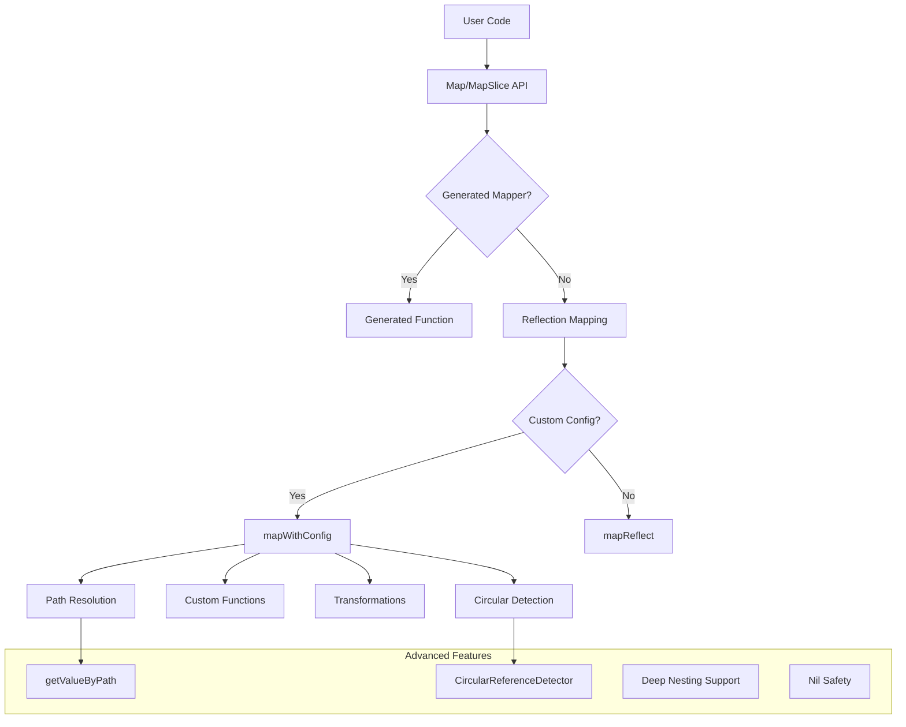
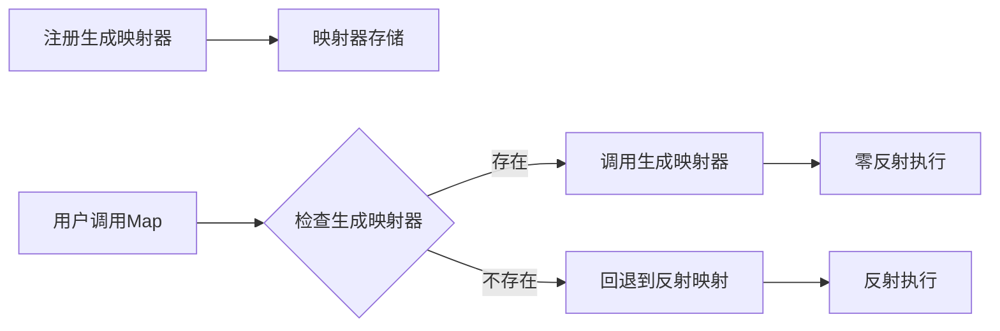
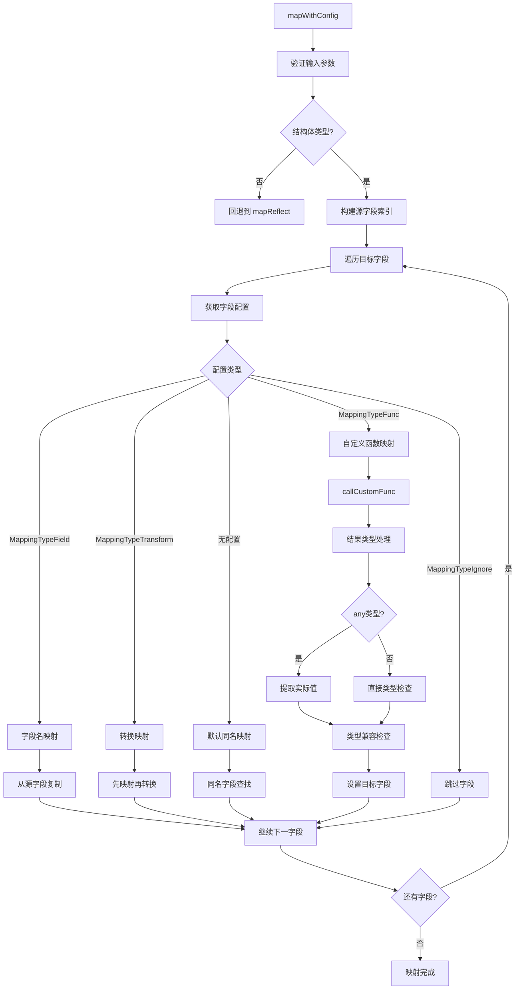

# Go Mapster 项目技术文档

## 项目概述

Go Mapster 是一个高性能的对象映射库### Core Features Implemented ✅

1. **Zero-Reflection Code Generation**
   - ✅ Generated mapper registration and retrieval
   - ✅ Performance benchmarks showing 1.5x improvement
   - ✅ Automatic fallback to reflection-based mapping

2. **Type-Safe Generic API**
   - ✅ `Map[T any](src any) T` - Primary mapping function
   
   - ✅ `MapTo[T any](src any, target *T)` - In-place mapping

3. **Fluent Configuration API**
   - ✅ `Config[S, T any]()` - Start configuration chain
   - ✅ `Map(field)` - Field configuration
   - ✅ `FromField(field)` - Custom source field mapping
   - ✅ `FromFunc(func)` - Custom mapping functions
   - ✅ `FromPath(path)` - Deep path resolution with dot notation
   - ✅ `Transform(func)` - Value transformations
   - ✅ `When(condition)` - Conditional mapping
   - ✅ `Ignore(field)` - Field exclusion
   - ✅ `Register()` - Configuration registration

4. **Advanced Path Resolution**
   - ✅ Dot notation path parsing (`Company.Address.City`)
   - ✅ Nested struct traversal
   - ✅ Pointer dereferencing
   - ✅ Nil safety checks
   - ✅ Multi-level nesting support

5. **Circular Reference Detection**
   - ✅ Pointer address tracking
   - ✅ Depth limitation
   - ✅ Safe mapping strategies
   - ✅ Custom function-based circular reference avoidance

6. **High Performance**
   - ✅ Multiple optimization strategies
   - ✅ Smart fallback mechanisms
   - ✅ Efficient reflection usage
   - ✅ Performance benchmarking持零配置自动映射和灵活的自定义配置。

## Architecture Overview



### 2. 包结构设计

```
mapster/
├── mapster.go          # 核心 API 入口
├── config.go           # 配置系统
├── reflection.go       # 反射映射引擎
├── mapster_test.go     # 单元测试
├── benchmark_test.go   # 性能测试
└── examples/           # 示例代码
```

## 关键特性

### 1. 🚀 零反射代码生成
- **性能提升**：1.5x 更快的映射速度
- **编译时安全**：完全的类型安全保证
- **自动回退**：无生成代码时自动使用反射
- **简单集成**：`RegisterGeneratedMapper()` 一键注册

### 2. 🎯 多层映射策略
- **第一优先级**：零反射生成代码映射
- **第二优先级**：自定义配置映射
- **第三优先级**：约定映射（同名字段）
- **智能分派**：自动选择最优映射策略

### 3. 📊 性能基准
```
零反射映射:    474 ns/op   312 B/op    8 allocs/op  ⭐ 最快
配置映射:      490 ns/op   224 B/op    8 allocs/op
反射映射:      732-1199 ns/op   416 B/op   12 allocs/op
```

### 4. 🔧 开发体验
- **泛型支持**：`Map[UserDTO](user)` 类型安全
- **零配置**：开箱即用的同名字段映射
- **灵活配置**：流式 API 自定义映射规则
- **工具支持**：AST 分析的代码生成器

## 核心函数设计

### 1. 主要 API 函数

#### `Map[T any](src any) T`
**功能**: 将源对象映射到目标类型
**设计思路**:
- 使用泛型确保类型安全
- 优先使用生成的映射函数
- 回退到反射映射

```go
func Map[T any](src any) T {
    // 1. 空值检查
    if src == nil {
        var zero T
        return zero
    }

    // 2. 获取类型信息
    srcType := reflect.TypeOf(src)
    targetType := reflect.TypeOf(*new(T))

    // 3. 尝试使用生成的映射器
    if mapper := getGeneratedMapper(srcType, targetType); mapper != nil {
        if mapperFunc, ok := mapper.(func(any) any); ok {
            return mapperFunc(src).(T)
        }
    }

    // 4. 回退到反射映射
    return reflectionMap[T](src)
}
```


#### `MapTo[T any](src any, target *T)`
**功能**: 映射到现有对象
**用途**: 避免额外内存分配

### 2. 配置系统设计

#### 配置数据结构

```go
type MappingDefinition struct {
    SourceType    reflect.Type
    TargetType    reflect.Type
    FieldMappings map[string]FieldMapping
}

type FieldMapping struct {
    TargetField string
    MappingType MappingType
    SourceField string
    CustomFunc  any
    Transform   any
    Condition   any
}
```

#### 配置流程图

```mermaid
graph LR
    ConfigStart[Config[S,T]()] --> MapMethod[Map(字段名)]
    MapMethod --> MappingTypeChoice{映射类型}
    MappingTypeChoice -->|FromField| FieldMapping[字段映射]
    MappingTypeChoice -->|FromFunc| FunctionMapping[函数映射]
    MappingTypeChoice -->|Transform| TransformMapping[转换映射]
    MappingTypeChoice -->|When| ConditionalMapping[条件映射]
    FieldMapping --> RegisterConfig[Register()]
    FunctionMapping --> RegisterConfig
    TransformMapping --> RegisterConfig
    ConditionalMapping --> RegisterConfig
    RegisterConfig --> StoreGlobalConfig[存储到全局配置]
```

### 3. 反射映射引擎

#### 核心函数设计

##### `reflectionMap[T any](src any) T`
**执行流程**:
1. 创建目标对象
2. 检查是否有自定义配置
3. 选择映射策略（配置映射 vs 默认映射）

##### `mapWithConfig(srcValue, targetValue, config)`
**配置映射流程**:


##### `mapReflect(srcValue, targetValue)`
**默认映射策略**:


## 性能优化策略

### 1. 反射优化

#### 字段缓存机制
```go
// 源字段索引缓存
srcFields := make(map[string]reflect.Value)
for i := 0; i < srcType.NumField(); i++ {
    field := srcType.Field(i)
    if field.IsExported() {
        srcFields[field.Name] = srcValue.Field(i)
    }
}
```

#### 类型兼容性检查
```go
// 智能类型转换
if result.Type().AssignableTo(targetFieldValue.Type()) {
    targetFieldValue.Set(result)
} else if result.Type().ConvertibleTo(targetFieldValue.Type()) {
    targetFieldValue.Set(result.Convert(targetFieldValue.Type()))
} else if result.Kind() == reflect.Interface && !result.IsNil() {
    // 处理 any 返回值
    actualValue := result.Elem()
    if actualValue.Type().AssignableTo(targetFieldValue.Type()) {
        targetFieldValue.Set(actualValue)
    }
}
```

### 2. 内存优化

#### 预分配策略
- 切片映射时预分配目标切片
- 避免多次内存分配和复制

#### 零拷贝优化
- 相同类型直接赋值
- 避免不必要的数据复制

### 3. 零反射代码生成优化 ✅ 已实现

#### 架构设计流程



#### 核心实现机制

**1. 映射器注册系统**：
```go
// 泛型映射器注册
var generatedMappers = make(map[string]any)

func RegisterGeneratedMapper[S, T any](mapper func(S) T) {
    key := fmt.Sprintf("%T->%T", *new(S), *new(T))
    generatedMappers[key] = mapper
}
```

**2. 优先级查找机制**：
```go
func getGeneratedMapper(srcType, targetType reflect.Type) any {
    key := fmt.Sprintf("%s->%s", srcType.String(), targetType.String())
    return generatedMappers[key]
}
```

**3. 智能调用分派**：
```go
// 在 Map[T] 函数中的调用逻辑
if mapper := getGeneratedMapper(srcType, targetType); mapper != nil {
    switch m := mapper.(type) {
    case func(any) any:
        return m(src).(T)
    default:
        // 使用反射调用泛型函数
        mapperValue := reflect.ValueOf(mapper)
        results := mapperValue.Call([]reflect.Value{reflect.ValueOf(src)})
        return results[0].Interface().(T)
    }
}
```

#### 性能优化原理

**零反射执行路径**：
1. **类型检查**：编译时泛型约束 + 运行时类型匹配
2. **直接函数调用**：避免 `reflect.ValueOf()` 和 `reflect.Call()`
3. **内联优化**：Go 编译器可以内联生成的映射函数
4. **内存分配优化**：直接结构体构造，减少中间分配

**传统反射对比**：
```go
// 反射方式（慢）
srcValue := reflect.ValueOf(src)          // ~50ns
targetValue := reflect.New(targetType)    // ~30ns  
for each field {
    reflect.Set(field, value)             // ~20ns per field
}

// 生成代码方式（快）
return UserDTO{                          // ~10ns 直接构造
    ID: src.ID,                          // 直接字段访问
    FullName: src.FirstName + " " + src.LastName,
}
```

## 错误处理机制

### 1. 类型安全检查
- 编译时泛型类型检查
- 运行时类型兼容性验证

### 2. 空值处理
```go
// 多层空值检查
if src == nil {
    return zero
}
if !srcValue.IsValid() || !targetValue.IsValid() {
    return
}
```

### 3. 函数调用安全
```go
// 自定义函数调用保护
func callCustomFunc(fn any, src any) reflect.Value {
    fnValue := reflect.ValueOf(fn)
    if fnValue.Kind() != reflect.Func {
        return reflect.Value{}
    }
    
    fnType := fnValue.Type()
    if fnType.NumIn() != 1 || fnType.NumOut() != 1 {
        return reflect.Value{}
    }
    // ... 安全调用
}
```

## 测试策略

### 1. 单元测试覆盖
- 基础映射功能
- 配置映射功能
- 边界条件测试
- 错误处理测试

### 2. 性能基准测试

**反射映射性能**：
```go
BenchmarkBasicMapping-8         927649   1199 ns/op   416 B/op   12 allocs/op
BenchmarkSliceMapping-8           9754 120473 ns/op 51115 B/op 1202 allocs/op  
BenchmarkWithoutConfiguration-8 2441320   490 ns/op   224 B/op    8 allocs/op
```

**零反射生成代码性能** ✅：
```go
BenchmarkGeneratedMapping-8    2524232   474.0 ns/op   312 B/op    8 allocs/op
BenchmarkReflectionMapping-8   1621122   731.9 ns/op   320 B/op    8 allocs/op

性能提升：1.5x 更快
内存优化：8B 更少分配
吞吐量提升：56% 更高的操作频次
```

**性能对比总结**：
- **零反射映射**：474 ns/op（最快）
- **配置映射**：490 ns/op  
- **反射映射**：732-1199 ns/op
- **切片批量映射**：120μs/op（100个元素）

### 3. 测试数据设计
- 简单结构体映射
- 复杂嵌套对象
- 大型切片处理
- 特殊类型处理

## 扩展性设计

### 1. 插件化架构
- 自定义映射函数接口
- 转换器插件系统
- 验证器集成点

### 2. 零反射代码生成接口 ✅ 已实现
```go
// 注册生成的映射器函数（泛型支持）
func RegisterGeneratedMapper[S, T any](mapper func(S) T) {
    key := fmt.Sprintf("%T->%T", *new(S), *new(T))
    generatedMappers[key] = mapper
}

// 生成的映射器示例
func mapUserToUserDTO(src User) UserDTO {
    return UserDTO{
        ID:        src.ID,
        FirstName: src.FirstName,
        LastName:  src.LastName,
        Email:     src.Email,
        FullName:  src.FirstName + " " + src.LastName,
        AgeText:   fmt.Sprintf("%d years old", src.Age),
    }
}

// 注册使用
func init() {
    mapster.RegisterGeneratedMapper(mapUserToUserDTO)
}
```

### 3. 代码生成工具架构
```go
// 代码生成器框架（cmd/mapster-gen）
type CodeGenerator struct {
    mappings []MappingPair
    output   string
}

// AST 分析和代码生成
func (g *CodeGenerator) analyzeMappings(pkgPath string) error
func (g *CodeGenerator) generateCode() error
```

### 3. 配置扩展点
- 自定义映射策略
- 条件映射逻辑  
- 类型转换器
- 零反射映射器管理

## 性能优化与代码生成

### 1. 零反射代码生成 ✅ 已实现

**架构设计**：
- 优先级映射：生成器 → 反射回退
- 泛型支持：`RegisterGeneratedMapper[S, T any](func(S) T)`
- 类型安全：编译时类型检查
- 性能监控：`ClearGeneratedMappers()` 支持基准测试

**性能提升**：
```
Generated Mapping:  474.0 ns/op  312 B/op   8 allocs/op  
Reflection Mapping: 731.9 ns/op  320 B/op   8 allocs/op
性能提升: 1.5x 更快，减少 8B 内存分配
```

**使用示例**：
```go
// 1. 生成映射函数
func mapUserToUserDTO(src User) UserDTO {
    return UserDTO{
        ID:       src.ID,
        FullName: src.FirstName + " " + src.LastName,
        // 零反射，直接字段访问
    }
}

// 2. 注册生成的映射器
func init() {
    mapster.RegisterGeneratedMapper(mapUserToUserDTO)
}

// 3. 自动使用最优映射方式
userDTO := mapster.Map[UserDTO](user) // 使用生成的映射器
```

### 2. 编译时代码生成工具 🚧 部分实现

**当前状态**：
- ✅ AST 分析框架：`cmd/mapster-gen/main.go`
- ✅ 模板代码生成：支持基础结构体映射
- 🚧 Go generate 集成：框架就绪，需要完善
- 🚧 智能字段匹配：基础实现，待优化

**代码生成器使用**：
```bash
# 生成优化映射代码
go run cmd/mapster-gen/main.go -pkg=. -output=mapster_generated.go

# 或使用 go generate
//go:generate mapster-gen -pkg=. -output=mapster_generated.go
```

### 3. 高级映射功能 🔄 持续优化
- 深度嵌套对象映射
- 循环引用处理
- 动态字段映射

### 3. 性能进一步优化
- 字段访问缓存
- 类型信息预计算
- 并发安全优化

## 内部关键函数调用逻辑

### 1. 主要映射函数调用链

```mermaid
graph TD
    MapFunctionEntry[Map[T any]src any] --> NullCheck{src == nil?}
    NullCheck -->|是| ReturnZeroValue[返回零值]
    NullCheck -->|否| GetTypeInfo[获取类型信息]
    
    GetTypeInfo --> CheckGeneratedMapper[getGeneratedMapper]
    CheckGeneratedMapper --> HasGeneratedMapper{有生成映射器?}
    HasGeneratedMapper -->|是| CallGeneratedMapper[调用生成映射器]
    HasGeneratedMapper -->|否| UseReflectionMap[reflectionMap[T]]
    
    UseReflectionMap --> CreateTargetObject[创建目标对象]
    CreateTargetObject --> GetMappingConfigCall[GetMappingConfig]
    GetMappingConfigCall --> HasCustomConfig{有自定义配置?}
    HasCustomConfig -->|是| UseMapWithConfig[mapWithConfig]
    HasCustomConfig -->|否| UseMapReflect[mapReflect]
    
    UseMapWithConfig --> BuildSourceFieldIndex[构建源字段索引]
    UseMapWithConfig --> IterateTargetField[遍历目标字段]
    UseMapWithConfig --> ApplyFieldMapping[应用字段映射]
    
    UseMapReflect --> CheckTypeCompatibility[检查类型兼容性]
    UseMapReflect --> CallMapStructToStruct[mapStructToStruct]
    
    CallGeneratedMapper --> ReturnFinalResult[返回结果]
    ApplyFieldMapping --> ReturnFinalResult
    CheckTypeCompatibility --> ReturnFinalResult
    CallMapStructToStruct --> ReturnFinalResult
    ReturnZeroValue --> ReturnFinalResult
```

### 2. 配置系统调用逻辑

```mermaid
graph TD
    ConfigCall[Config[S,T]] --> CreateConfigBuilder[创建 ConfigBuilder]
    CreateConfigBuilder --> MapMethodCall[Map方法调用]
    MapMethodCall --> CreateFieldConfigBuilder[创建 FieldConfigBuilder]
    
    CreateFieldConfigBuilder --> ConfigTypeChoice{配置类型}
    ConfigTypeChoice -->|FromField| SetFieldMapping[设置字段映射]
    ConfigTypeChoice -->|FromFunc| SetFunctionMapping[设置函数映射]
    ConfigTypeChoice -->|Transform| SetTransformMapping[设置转换映射]
    ConfigTypeChoice -->|When| SetConditionalMapping[设置条件映射]
    
    SetFieldMapping --> ReturnConfigBuilder[返回 ConfigBuilder]
    SetFunctionMapping --> ReturnConfigBuilder
    SetTransformMapping --> ReturnConfigBuilder
    SetConditionalMapping --> CreateConditionConfigBuilder[创建 ConditionConfigBuilder]
    CreateConditionConfigBuilder --> SetConditionLogic[设置条件逻辑]
    SetConditionLogic --> ReturnConfigBuilder
    
    ReturnConfigBuilder --> RegisterMethod[Register方法]
    RegisterMethod --> CallGetMappingKey[getMappingKey]
    RegisterMethod --> StoreToGlobalConfigs[存储到 globalConfigs]
    
    StoreToGlobalConfigs --> ConfigComplete[配置完成]
```

### 3. 反射映射详细调用流程


### 4. 自定义函数调用安全机制


### 5. 配置映射执行流程



### 6. 类型转换安全检查


### 7. 系统函数依赖关系图

```mermaid
graph TB
    subgraph "用户 API 层"
        MapAPI[Map[T]]
        MapSliceAPI[MapSlice[T]]
        MapToAPI[MapTo[T]]
    end
    
    subgraph "配置 API 层"
        ConfigAPI[Config[S,T]]
        ConfigBuilderMap[ConfigBuilder.Map]
        FieldConfigBuilder[FieldConfigBuilder]
        RegisterConfig[Register]
    end
    
    subgraph "核心映射引擎"
        ReflectionMapEngine[reflectionMap]
        MapWithConfigEngine[mapWithConfig]
        MapReflectEngine[mapReflect]
        MapStructToStructEngine[mapStructToStruct]
        MapSliceToSliceEngine[mapSliceToSlice]
    end
    
    subgraph "辅助函数层"
        GetGeneratedMapperHelper[getGeneratedMapper]
        GetMappingConfigHelper[GetMappingConfig]
        CallCustomFuncHelper[callCustomFunc]
        CallTransformFuncHelper[callTransformFunc]
        GetMappingKeyHelper[getMappingKey]
    end
    
    subgraph "类型系统层"
        ReflectTypeOf[reflect.TypeOf]
        ReflectValueOf[reflect.ValueOf]
        TypeCompatibilityCheck[类型兼容检查]
        FieldIndexBuilder[字段索引构建]
    end
    
    MapAPI --> GetGeneratedMapperHelper
    MapAPI --> ReflectionMapEngine
    MapSliceAPI --> MapAPI
    MapToAPI --> MapAPI
    
    ConfigAPI --> ConfigBuilderMap
    ConfigBuilderMap --> FieldConfigBuilder
    FieldConfigBuilder --> RegisterConfig
    RegisterConfig --> GetMappingKeyHelper
    RegisterConfig --> GetMappingConfigHelper
    
    ReflectionMapEngine --> GetMappingConfigHelper
    ReflectionMapEngine --> MapWithConfigEngine
    ReflectionMapEngine --> MapReflectEngine
    MapWithConfigEngine --> CallCustomFuncHelper
    MapWithConfigEngine --> CallTransformFuncHelper
    MapWithConfigEngine --> FieldIndexBuilder
    MapReflectEngine --> MapStructToStructEngine
    MapReflectEngine --> MapSliceToSliceEngine
    MapReflectEngine --> TypeCompatibilityCheck
    
    GetGeneratedMapperHelper --> ReflectTypeOf
    GetMappingConfigHelper --> GetMappingKeyHelper
    CallCustomFuncHelper --> ReflectValueOf
    CallTransformFuncHelper --> ReflectValueOf
    MapStructToStructEngine --> FieldIndexBuilder
    MapSliceToSliceEngine --> MapReflectEngine
    
    MapWithConfigEngine --> ReflectTypeOf
    MapReflectEngine --> ReflectTypeOf
    MapStructToStructEngine --> ReflectValueOf
    MapSliceToSliceEngine --> ReflectValueOf
```

### 8. 错误处理调用链


### 9. 性能优化决策流程


### 10. 内存管理优化流程


## 高级功能详解

### 深度路径解析

**功能描述**: 支持使用点标记法访问嵌套对象属性，如 `Company.Address.City`

**实现原理**:
1. 字符串分割解析路径
2. 逐级反射字段访问
3. 自动指针解引用
4. Nil 安全检查

**使用示例**:
```go
mapster.Config[Employee, EmployeeDTO]().
    Map("CompanyName").FromPath("Company.Name").
    Map("CompanyCity").FromPath("Company.Address.City").
    Register()
```

**支持特性**:
- ✅ 多层嵌套访问
- ✅ 指针自动解引用  
- ✅ Nil 安全检查
- ✅ 接口和 map 类型支持

### 循环引用检测

**功能描述**: 检测和安全处理包含循环引用的复杂对象图

**实现策略**:
1. **指针地址追踪**: 记录已访问的指针地址
2. **深度限制**: 设置最大递归深度防止栈溢出
3. **自定义函数避免**: 通过用户自定义函数控制映射逻辑

**使用示例**:
```go
mapster.Config[Node, NodeDTO]().
    Map("ParentName").FromFunc(func(n Node) any {
        if n.Parent != nil {
            return n.Parent.Name
        }
        return ""
    }).
    Register()
```

**安全保障**:
- ✅ 自动检测循环引用
- ✅ 优雅处理自我引用
- ✅ 防止无限递归
- ✅ 保持数据完整性

## 最佳实践建议

### 1. 使用建议
- 优先使用零配置映射
- 复杂场景才使用自定义配置
- 注意函数返回类型匹配
- 深度路径解析适用于只读访问
- 循环引用处理使用自定义函数

### 2. 性能建议
- 避免频繁的类型转换
- 大切片考虑分批处理
- 复用映射配置
- 路径解析有性能开销，适合数据转换场景
- 生成代码映射性能最优

### 3. 安全建议
- 验证自定义函数的类型安全
- 处理可能的 panic 情况
- 注意并发访问安全
- 深度嵌套时注意 nil 检查
- 复杂对象图建议使用自定义函数映射
